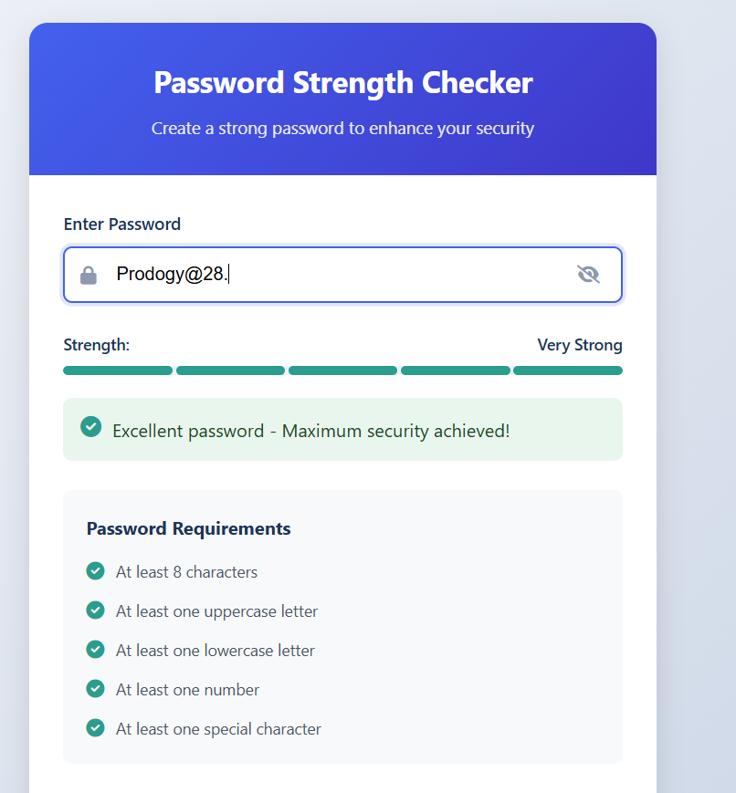
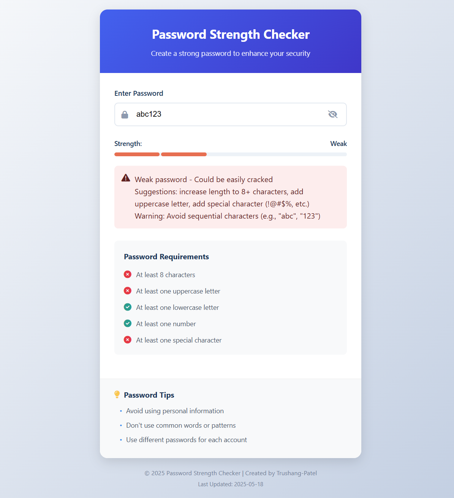
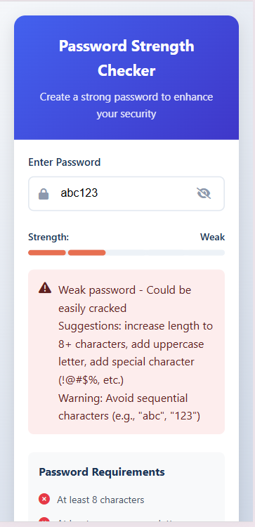

# Password Strength Checker

> A modern, interactive tool to assess password strength based on multiple security criteria.

[](https://opensource.org/licenses/MIT)
[](https://github.com/Trushang-Patel/PRODIGY_CS_03)

## 📋 Table of Contents
- [Overview](#overview)
- [Features](#features)
- [Screenshots](#screenshots)
- [Installation](#installation)
- [Usage](#usage)
- [Technologies Used](#technologies-used)
- [Customization](#customization)
- [Contributing](#contributing)
- [Author](#author)

## 🔍 Overview

The Password Strength Checker is a web application that helps users create stronger passwords by providing real-time feedback. It evaluates passwords based on industry-standard security criteria including length, character variety, and common patterns.

Perfect for:
- Educational purposes to demonstrate password security concepts
- Integration into registration forms
- Personal use when creating new accounts

## ✨ Features

- **Real-time Strength Analysis:** Instant feedback as you type
- **Visual Strength Indicator:** Color-coded segments show password strength
- **Comprehensive Criteria Checking:**
  - Minimum length (8+ characters)
  - Uppercase letters
  - Lowercase letters
  - Numbers
  - Special characters
- **Pattern Detection:** Identifies and warns about:
  - Repeated characters
  - Sequential patterns (123, abc)
  - Common password words
- **User-friendly Interface:**
  - Show/hide password toggle
  - Detailed improvement suggestions
  - Clean, responsive design
- **Password Security Tips**

## 📸 Screenshots

 Strong Password | Weak Password | Mobile View |
|:--------------:|:-------------:|:-----------:|
|  |  |  |
| Excellent security with all criteria met | Shows warning indicators and improvement suggestions | Responsive design for mobile devices |

## 💻 Installation

Simply clone this repository to your local machine:

```bash
git clone https://github.com/Trushang-Patel/PRODIGY_CS_03.git
cd PRODIGY_CS_03
```

No build process or dependencies are required. The application uses vanilla HTML, CSS, and JavaScript.

## 🚀 Usage

1. Open `index.html` in your web browser
2. Type a password in the input field
3. Observe the real-time feedback:
   - Strength meter changes color and fills segments
   - Criteria checklist updates with checkmarks
   - Detailed feedback provides improvement suggestions

### Online Demo

Try the live demo: [Password Strength Checker Demo](https://trushang-patel.github.io/PRODIGY_CS_03/)

## 🛠️ Technologies Used

- HTML5
- CSS3 (with custom properties and flexbox)
- Vanilla JavaScript
- Font Awesome 6 (for icons)

## 🎨 Customization

### Changing Colors

The application uses CSS custom properties (variables) for easy customization. To change the color scheme, edit the `:root` selector in `style.css`:

```css
:root {
    --primary-color: #4361ee;
    --primary-light: #4895ef;
    --primary-dark: #3f37c9;
    --danger-color: #e63946;
    /* other variables... */
}
```

### Adding More Criteria

To add new password criteria checks, modify the `checkPasswordStrength` function in `script.js`:

```javascript
const criteria = {
    length: password.length >= 8,
    uppercase: /[A-Z]/.test(password),
    // Add your new criteria here
    noSpaces: !/\s/.test(password),
};
```

Then add a corresponding element in the HTML:

```html
<li id="noSpaces"><i class="fas fa-times-circle"></i> No spaces allowed</li>
```

## 👥 Contributing

Contributions are welcome! Please feel free to submit a Pull Request.

1. Fork the repository
2. Create a new branch: `git checkout -b feature-name`
3. Make your changes
4. Commit your changes: `git commit -m 'Add some feature'`
5. Push to the branch: `git push origin feature-name`
6. Submit a pull request

## 👨‍💻 Author

Created by [Trushang-Patel](https://github.com/Trushang-Patel)

---

If you found this project helpful, please consider giving it a star on GitHub! ⭐
